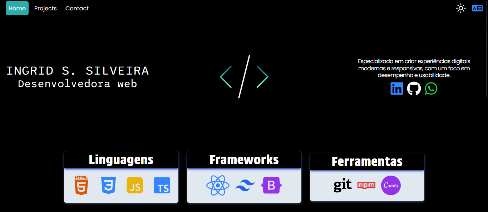

# Ingrid Souza's Portfolio

#### Bem-vindo(a) ao meu portfólio! 
Aqui você pode explorar minhas habilidades e projetos de forma interativa, com a opção de mudar entre os idiomas português e inglês, além de um modo de cor, permitindo a navegação em tema claro ou escuro.

O que você vai encontrar:
* Skills: Uma visão geral das minhas principais competências em linguagens de programação, frameworks e ferramentas, com ícones dinâmicos para uma experiência visual envolvente.
* Projetos: Demonstrações de projetos práticos que desenvolvi, focados em responsividade, design moderno e boas práticas de desenvolvimento.
* Formulário de Contato: Fique à vontade para entrar em contato comigo preenchendo o formulário, e responderei o mais rápido possível.

Explore, veja meu trabalho, e sinta-se livre para entrar em contato para colaborações ou oportunidades!

#### Acesse em https://ingriddev.netlify.app/

## 📦 Tecnologias usadas:
 
 

## 👷 Autores

* **Ingrid Souza** - *Front-End* - [GitHub](https://github.com/IngridsSilveira)